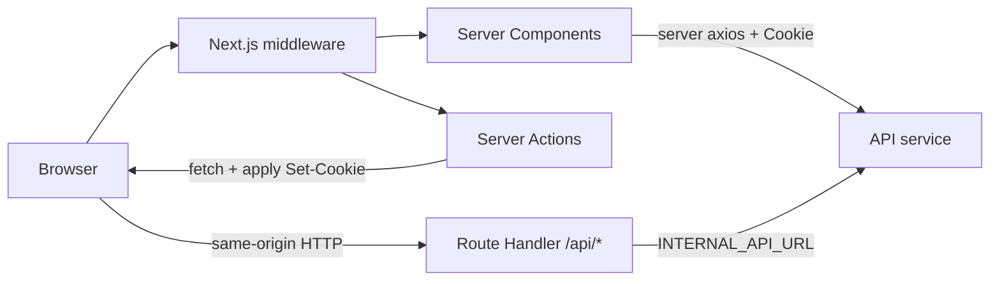

# Next.js Frontend

## Quick start

- Dev: `bun run dev` (or `npm run dev` / `pnpm dev`)
- Format: `bun run format`
- Lint: `bun run lint`
- Test: `bun run test` (watch: `bun run test:watch`)
- Build: `bun run build`
- Pre-push check: `bun run validate` (lint + build)

## Current template structure (real repo state)

- **App router**
  - Present now: `src/app/layout.tsx`, `src/app/(main)/layout.tsx`, `src/app/(main)/page.tsx`, `src/app/globals.css`.
  - Root layout already wraps app with `QueryProvider`.
- **Components**
  - Present now: `src/components/layout/MainShell.tsx`, `src/components/ui/button.tsx`.
- **Lib utilities**
  - Present now: `src/lib/https.ts`, `src/lib/supabase.ts`, `src/lib/forceLogout.tsx`, `src/lib/providers/query-provider.tsx`, `src/lib/utils.ts`.
- **Styling / UX**
  - Design tokens in `globals.css`; use `cn(...)` for class composition.
- **React Query defaults**
  - Configure once in `QueryProvider` (`staleTime`, `gcTime`, refetch flags). Tune per product; SSR pages often use `force-dynamic` regardless.
- **SSR-oriented additions (pattern to replicate)**
  - `src/app/api/[...path]/route.ts` — catch-all proxy to internal API
  - `src/lib/api/server.ts` — server-only Axios + `cookies()` forwarding
  - `src/lib/auth/session.ts`, `actions.ts`, `user-context.tsx` — session + server actions + client context

## Hard conventions (cookie auth + SSR)

- **No localStorage/sessionStorage for access tokens or user identity.**
- **Browser HTTP** uses same-origin `API_PREFIX` (e.g. `/api/v1`) so cookies are first-party; use `withCredentials: true` on Axios/fetch.
- **Server HTTP** uses `INTERNAL_API_URL` (or equivalent **server-only** env var)—never `NEXT_PUBLIC_*` for the internal API base.
- **Two HTTP clients:**
  - **Client:** `src/lib/https.ts` (or `src/lib/api/client.ts`) — relative `/api/v1`, CSRF header on unsafe methods, refresh-on-401 once.
  - **Server:** `import "server-only"` module — Axios/fetch to internal API, attach `Cookie` from `next/headers` and `X-CSRF-Token` from `csrf_token` cookie on mutations.
- **Auth forms:** `loginAction` / `signupAction` server actions call API directly, then **`cookies().set`** from parsed `Set-Cookie` headers (or use a small parser for each cookie line).
- **Layouts:** protected route group `layout.tsx` is `async`; `await requireSession()`; pass serializable user into a thin **client** shell wrapped in `<UserProvider user={...}>`.
- **Middleware:** **presence-only** check (`access_token` and/or `refresh_token` cookie); no JWT decode on Edge. Real auth = RSC + API.
- **Caching:** per-user pages `export const dynamic = "force-dynamic"` (or fetch `cache: "no-store"`). After login/logout: `revalidatePath("/", "layout")` in server actions.

### Request flow (mental model)

- **Browser XHR/fetch:** only to the Next origin (`/api/v1/...`); cookies are set for that origin.
- **RSC / server actions:** may bypass the proxy and call the API directly with forwarded `Cookie` (faster, no double hop for SSR).

## Deprecated for new work

- Storing `auth:token` / `auth:user` in localStorage
- A separate `axios.ts` that reads tokens from localStorage for browser calls
- `enabled: !!localStorage.getItem("auth:token")` in React Query — use session user id from context or assume layout already gated auth

## Repo conventions

- **API response envelope**
  - Centralize `APIResponse<T>` and `API_PREFIX` (e.g. `/api/v1`).

- **Catch-all Route Handler proxy** (`src/app/api/[...path]/route.ts`)
  - **Purpose:** Browser calls `https://app.example.com/api/v1/...`; Next forwards to `INTERNAL_API_URL/api/v1/...` so `Set-Cookie` from the API is applied to the **app origin**.
  - Forward method, body (streaming), query string, and **Cookie** header.
  - Copy response status/body; forward **all** `Set-Cookie` headers (`getSetCookie()` in Node, not a single merged string).
  - Strip hop-by-hop headers (`host`, `connection`, …).
  - `export const dynamic = "force-dynamic"` (or equivalent) so caching does not cache authenticated responses at the edge.
  - Implement `GET`, `POST`, `PUT`, `PATCH`, `DELETE` (and `OPTIONS` if preflight needed).

- **Client Axios** (`src/lib/https.ts` pattern)
  - `baseURL: ""` or relative; paths prefixed with `API_PREFIX`.
  - `withCredentials: true`.
  - Request interceptor: for unsafe methods, read **non-HttpOnly** `csrf_token` from `document.cookie` and set `X-CSRF-Token`.
  - For `FormData`, drop `Content-Type` so the browser sets the boundary.
  - Response interceptor: on **401**, **once** `POST /api/v1/auth/refresh` with `credentials: "include"`, then retry original request; if refresh fails, call logout redirect helper.
  - **Never** read JWT from localStorage.

- **Server axios** (`src/lib/api/server.ts` pattern)
  - First line: `import "server-only"`.
  - `baseURL: process.env.INTERNAL_API_URL` (with safe dev fallback only if you accept that risk).
  - Interceptor: `import("next/headers").then(({ cookies }) => …)` — build `Cookie` header from `cookies().getAll()`; for POST/PUT/PATCH/DELETE add `X-CSRF-Token` from `csrf_token` cookie.
  - Default to **no caching** for per-user fetches (`cache: "no-store"` on fetch, or Axios equivalents).
  - Helpers: `serverGet`, `serverPost`, … that unwrap envelopes and optionally `swallow401` for optional session reads.

- **Session helpers** (`src/lib/auth/session.ts`)
  - `getSession`: `React.cache(async () => { … })` calling `GET /auth/me` via **server** client; return `null` if unauthenticated.
  - `requireSession(redirectTo?)`: if no session, `redirect()` to login (and optionally preserve `?next=`).
  - `requireRole(role)`: compose with `requireSession`.

- **Server actions** (`src/lib/auth/actions.ts` with `"use server"`)
  - Post to internal `…/api/v1/auth/login` (and signup) with `fetch`, `cache: "no-store"`.
  - Parse upstream `Set-Cookie` lines into structured fields and `cookies().set({ name, value, path, maxAge, … })` for each.
  - Logout: forward cookies to API logout, apply clearing `Set-Cookie`, delete cookies locally, `revalidatePath("/", "layout")`, `redirect("/login")`.
  - Login/signup success: `revalidatePath("/", "layout")` so the next RSC read sees cookies.

- **User context for client islands** (`user-context.tsx`)
  - `UserProvider` receives **server-resolved** user (id, name, email, role, …).
  - Export `useSessionUser`, `useRole`, `usePermissions` — **do not** read `localStorage`.
  - Pure `getPermissionsFor(role)` stays in a small `permissions.ts` module.

- **React Query**
  - Keep HTTP in `src/lib/apis/**`; option builders + `queryKeys` in `src/lib/queryApi.ts`.
  - `enabled` should use **numeric ids** or route context — not `localStorage` token checks.
  - For SSR + hydration: wrap client subtree in `<HydrationBoundary state={dehydrate(queryClient)}>` after `queryClient.setQueryData` in a **server** page.

- **WebSockets**
  - URL: same origin as the page, e.g. `wss://host/api/v1/ws/chat` — **no** `?token=` if the API accepts cookies on upgrade.
  - On close code policy violation (e.g. 1008), optionally trigger one refresh before reconnect.

- **Third-party uploads (e.g. Supabase)**
  - If storage paths include `userId`, pass `userId` from `useSessionUser()` into `handleUpload(file, userId)` — do not read identity from localStorage.

## Notifications implementation (React Query + optimistic cache)

Pattern: infinite pagination, option builders, optimistic updates with rollback.

- **Where code lives**
  - UI and helpers under `src/components/notifications/*`
  - `queryKeys.notifications.*`, `queryApi.notifications.*`
  - Types: `APIResponse<NotificationListResponse>`

- **Query option builders**
  - Infinite list: `queryApi.notifications.infiniteList(userId, pageSize)` — `userId` from `useSessionUser().id` (or props), not localStorage.
  - Keys must include stable partitions (`userId`, `pageSize`, …) for cache identity.

- **Infinite pagination rules**
  - `getNextPageParam` uses the API paging envelope (`total`, `offset`, `results.length`) to compute next offset and stop at end-of-list.
  - Stop when `success=false`, `data` missing, `results.length === 0`, or `nextOffset >= total`.

- **Merging + grouping for display**
  - `flattenNotificationPages(pages)` merges `pages[]` into one list, deduping by notification `id`.
  - `groupNotificationsForDisplay(items)` buckets by `"today" | "yesterday" | "earlier"` and keeps newest-first ordering.

- **Optimistic mark-as-read with rollback**
  - Optimistic updates patch *both* caches:
    - Infinite list cache
    - Badge list cache
  - Helpers in `src/components/notifications/notification-cache.ts`:
    - `readNotificationCachesSnapshot(...)` captures current cache values for rollback.
    - `writeOptimisticMarkRead(..., { ids } | { all: true })` patches cached pages to mark notifications as read.
    - `restoreNotificationCaches(...)` restores the snapshot if the mutation fails.
  - Patch behavior:
    - `applyReadToPage(...)` sets `is_read: true` and fills `read_at` with “now” when missing.
    - `mapInfiniteReadPages(...)` applies the patch across all infinite pages.

## Middleware (Edge) pattern

- Match only routes that need redirects (auth + protected prefixes).
- If path is **auth** (`/auth/...`) and auth cookies present → redirect to app home (e.g. `/dashboard`).
- If path is **protected** and **no** access or refresh cookie → redirect to `/auth/login?next=<encoded path>`.
- Cookie names must match the API (`access_token`, `refresh_token`, etc.).
- Do not rely on middleware for RBAC—only cookie **presence**.

## Additional conventions

- **Per-domain API modules:** `src/lib/apis/<domain>/*.ts` for client-side `get/post/...` wrappers.
- **Per-domain server wrappers:** `src/lib/api/server/<domain>.ts` with `import "server-only"` reusing envelope types.
- **Centralize `API_PREFIX`** — avoid scattering `/api/v1` string literals.
- **Logout:** `forceLogout()` calls `POST /api/v1/auth/logout` with credentials + CSRF header, then `window.location` to login (full navigation clears in-memory state).

## Environment/config touchpoints

- **`INTERNAL_API_URL`** (server-only): direct base URL to the API for Route Handler proxy + server axios + server actions. **Never** prefix with `NEXT_PUBLIC_`.
- **Optional:** `NEXT_PUBLIC_DEV_URL` / `NEXT_PUBLIC_BACKEND_URL` for legacy fallbacks or non-proxy tooling only.
- **Supabase (or similar):** public URL + anon key remain `NEXT_PUBLIC_*` by design.

## Feature-add workflow (SSR-first)

1. **Data ownership:** default to a **Server Component** page; fetch with `serverGet` / domain server wrapper; `export const dynamic = "force-dynamic"` when data is per-user.
2. **Auth gate:** protected segment `layout.tsx` calls `requireSession()` and passes user into `UserProvider` + shell.
3. **Interactivity:** extract a `"use client"` island; use `useSessionUser()` for id/role; use React Query for mutations, optimistic UI, infinite scroll.
4. **Hydration (optional):** in the server page, `new QueryClient()` → `setQueryData` → `<HydrationBoundary state={dehydrate(queryClient)}>` around the client island.
5. **New API surface:** add client wrappers under `src/lib/apis/…` (browser) and optionally `src/lib/api/server/…` (RSC).
6. Run `lint`, `tsc --noEmit`, `build`.

## Quality gate before handoff

- [ ] No JWT or user identity in localStorage for auth
- [ ] Browser uses same-origin `/api/v1` + `withCredentials`; mutations send CSRF header
- [ ] Server-only code imports `server-only` and uses `INTERNAL_API_URL`
- [ ] Protected layouts use `requireSession`; middleware aligns with cookie names
- [ ] Login/logout server actions update cookies and call `revalidatePath`
- [ ] `build` passes; new env vars documented
